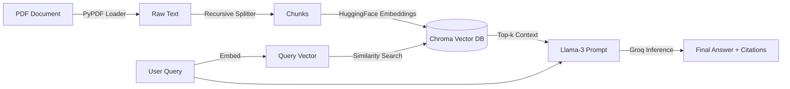

# DocuMind-RAG

# DocuMind: Enterprise Financial RAG Analyst


**DocuMind** is an autonomous AI agent designed to analyze dense financial documents (like SEC 10-K filings) and answer complex investor queries with high precision. 

Unlike standard chatbots, DocuMind uses **Retrieval Augmented Generation (RAG)** to ground its answers in factual data, providing specific **page-level citations** for every claim it makes.

---

## Key Features

* **Sub-Second Latency:** Powered by **Groq's LPU (Language Processing Unit)**, delivering Llama-3 inference at >300 tokens/second.
* **Long-Context Understanding:** Uses **Recursive Character Chunking** to preserve the semantic structure of financial tables and multi-paragraph risk factors.
* **Auditability (Source Citations):** Every answer includes a "Sources" section, tracing the AI's reasoning back to the specific PDF page number.
* **Private & Free Embeddings:** Uses local HuggingFace embeddings (`all-MiniLM-L6-v2`) running on-device, ensuring document vectors are not sent to third-party APIs.
* **Persistent Memory:** Automatically caches vectors in `ChromaDB` to prevent re-indexing the same document twice.

version2:
* **Conversational Memory**: Remembers context from previous turns. You can ask "What was the revenue?" followed by "How does that compare to last year?"
* **Persistence**: Uses SQLite to save conversation history to disk (memory.db). Your chat history survives script restarts.
* **History-Aware Retrieval**: A specialized "Re-writer" chain reformulates follow-up questions to ensure accurate vector database searches.
---

## Tech Stack

| Component | Technology | Reasoning |
| :--- | :--- | :--- |
| **Orchestration** | [LangChain](https://www.langchain.com/) | For building the RAG retrieval pipeline and context window management. |
| **LLM Inference** | [Groq](https://groq.com/) (Llama-3-8b) | Chosen for ultra-low latency, crucial for real-time analyst tools. |
| **Vector DB** | [ChromaDB](https://www.trychroma.com/) | Lightweight, open-source vector store for semantic search. |
| **Embeddings** | [HuggingFace](https://huggingface.co/) | `all-MiniLM-L6-v2` for state-of-the-art sentence similarity without API costs. |
| **Data Ingestion** | `PyPDF` | For extracting raw text from unstructured PDF layouts. |
| **Memory Store** | `SQLite (SQLChatMessageHistory)` | for storing chat history in version 2|

---

## Installation

1.  **Clone the Repository**
    ```bash
    git clone [https://github.com/yourusername/DocuMind.git](https://github.com/yourusername/DocuMind.git)
    cd DocuMind
    ```

2.  **Install Dependencies**
    ```bash
    pip install langchain langchain-groq langchain-huggingface langchain-chroma pypdf sentence-transformers
    ```

3.  **Set up API Keys**
    * Get a free API Key from [Groq Console](https://console.groq.com/).
    * Set it in your environment (or use Colab User Secrets):
    ```bash
    export GROQ_API_KEY="gsk_..."
    ```

---

## Usage

1.  **Prepare Data:** Place your target PDF (e.g., `apple_10k.pdf`) in the project root.
2.  **Run the Agent:**
    ```bash
    python documind.py
    ```
3.  **Interact:**
    ```text
    Initializing DocuMind Financial Analyst...
    Loading apple_10k.pdf...
    Knowledge Base Ready!

    [Investor]: What are the primary foreign exchange risks mentioned?
    
    Analyzing...
    
    Answer (0.8s):
    The company faces risks related to fluctuations in the value of the U.S. dollar 
    relative to foreign currencies, particularly the Euro, Chinese Renminbi, and Japanese Yen. 
    This impacts net sales and operating margins...

    Sources:
    - Page 42: ...foreign currency exchange rates...
    - Page 18: ...international operations risks...
    ```

    version 2:
    ```
    Example Conversation Flow
    [Investor]: What was the total net sales for 2022? [Analyst]: The total net sales for 2022 were $394,328 million.

    [Investor]: How does that compare to 2021? (Tests Context) [Analyst]: That represents an 8% increase compared to 2021, where net sales were $365,817 million.

    [Investor]: exit

    ... Restart the script ...

    [Investor]: What was the 2021 figure we just discussed? (Tests Persistence) [Analyst]: We discussed that the 2021 net sales were $365,817 million.
    ```
---

## Architecture


## version 2 Architecture upgrade

DocuMind uses a History-Aware RAG pipeline:
1. **Input**: User asks a question (e.g., "Is it higher?").
2. **Contextualization Chain**: The LLM rewrites the question using chat history (e.g., "Is Apple's 2022 revenue higher?").
3. **Retrieval**: The re-phrased question searches ChromaDB for relevant PDF chunks.
4. **Generation**: The LLM generates an answer using the retrieved chunks.
5. **Storage**: The interaction is saved to memory.db via SQLite.

## Future Improvements
Hybrid Search: Implementing BM25 keyword search to improve retrieval for specific numerical values (e.g., "Error 505").

Table Parsing: Integrating Unstructured.io to better parse complex financial balance sheets.

Agentic Routing: Using LangGraph to let the AI decide when to use a Calculator tool for financial ratios.

### Contributing
Open to contributions! Please fork the repo and submit a PR.

Author: Devika Rudagi

License: MIT
